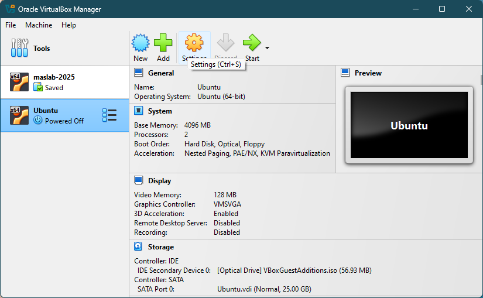
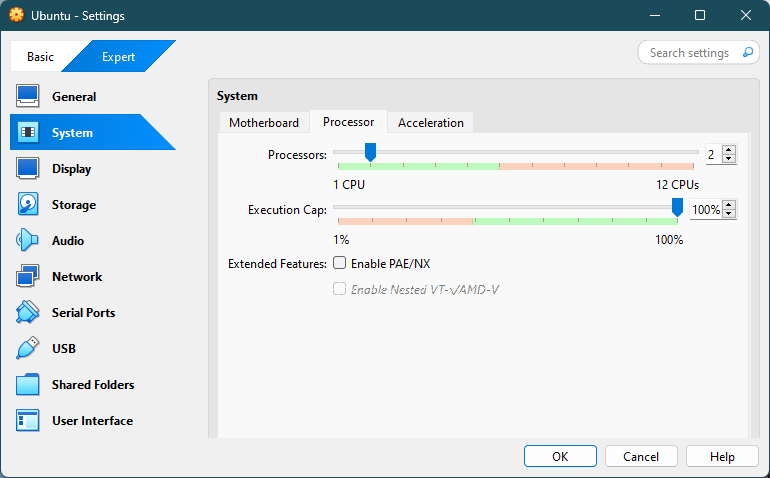
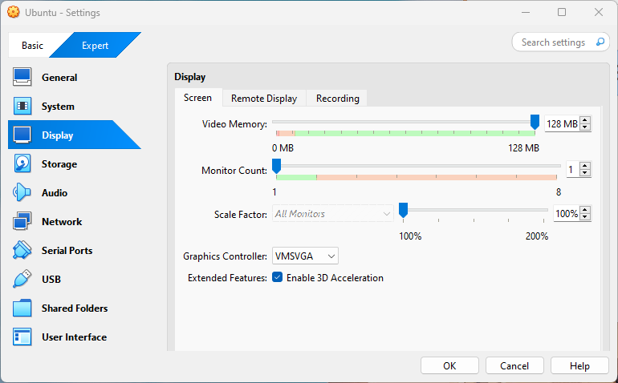
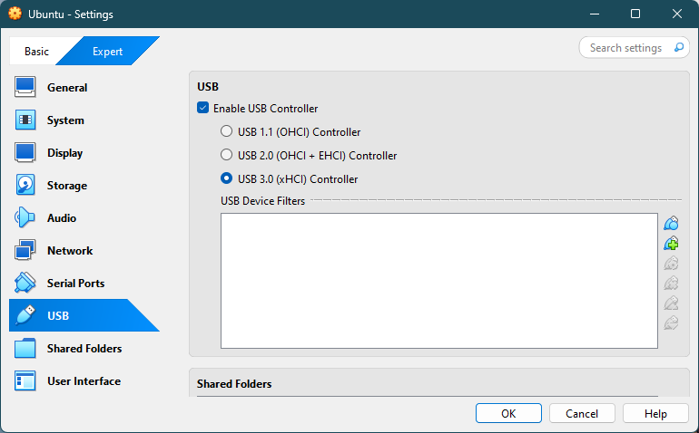

# ros2-setup
Setup procedure for local ROS2 installation
## Install Ubuntu 24.04
### Virtual machine (Recommended)
If you are not already using Ubuntu 24.04, using virtual machine software to install and run Ubuntu on your computer is recommended for flexibility and ease of installation. Below is the instruction to set up Ubuntu on using VirtualBox.
#### Download and install Virtualbox
1. Download VirtualBox at: https://www.virtualbox.org/wiki/Downloads. 
> [!IMPORTANT] 
> Download **BOTH** _VirtualBox platform packages_ for your operating system **AND** _VirtualBox Extension Pack_.
2. Once both are downloaded, run the VirtualBox platform package installation file and follow through the software installation system to install Virtualbox.
3. Once VirtualBox installation is finished, open the VirtualBox Extension Pack to install extension pack.
#### Download and install Ubuntu 24.04 on VirtualBox
1. Download Ubuntu 24.04 installation .iso file at: https://ubuntu.com/download/desktop
> [!IMPORTANT]
> Download Ubuntu 24.04.x LTS. **NOT** Ubuntu 24.10
2. After downloading Ubuntu install file, follow this video to install Ubuntu on VirtualBox: https://www.youtube.com/watch?v=yw9c991-4KE 
> [!NOTE]
> Recommended settings:
> * 30Gb storage
> * At least 4Gb memory and at most half your computer's memory

> [!NOTE]
> The installation may show this error. Just ignore it and wait it out.
> 

#### Install VirtualBox Guest Additions
VirtualBox Guest Additions enables drag-and-drop from your computer to virtual Ubuntu and better graphic supports. To install:
1. Log in and follow through the welcome screen.  
2. Open `Terminal` by pressing `Ctrl+Alt+T` or `Control+Option+T`
3. Run the following commands:
    ```shell
    sudo apt update
    sudo apt install -y build-essential dkms linux-headers-$(uname -r)
    ```
> [!TIP]
> `Sudo` allow you to install / modify system files thus requires entering your password. Ubuntu terminal does not show typing while entering password to `password for <user>:` prompt. Just keep typing the password and hit `Return/Enter` to submit password.
4. Select `Devices` > `Insert Guest Addition CD image...`.  
      

5. Open the CD and click `Run Software`.  
      
6. Enter password and allow the installation to run.   
    
7. Press `Enter` to close the opened terminal when installation finishes.
8. Click `Devices` and enable `Shared Clipboard` to copy and paste and `Drag and Drop` to drag files between your main computer environment and the virtual Ubuntu.  
    
9. Restart by clicking top right corner > power button and select `Restart...`  
    

#### Additional settings
For better experience in virtual Ubuntu, make the following changes to the virtual machine settings.

1. Turn off Ubuntu by clicking top right corner > power button and select `Power Off...`  
2. In VirtualBox manager, select the virtual machine and click the `Settings` gear.  
    

3. Switch from `Basic` to `Expert` mode.  
4. Select `System` and make sure processors count is at least 2 with 100% execution cap.  
    

5. Select `Display` and make sure video memory is maxed out at 128MB and 3D Acceleration is enabled in Extended Features.  
    

6. Select `USB` and make sure USB Controller is enabled and set to USB 3.0.  
    

7. Click `Ok` to save the settings.

## Install ROS 2
MASLAB staffs have prepared a script to automatically install and setup your Ubuntu installation for ROS 2. To use the script:
1. Open `Terminal`
2. Run the following commands:
    ```shell
    wget https://raw.githubusercontent.com/MASLAB/ros2-setup/refs/heads/main/setup.sh
    ./setup.sh
    ```
3. Enter your team's number and press `Enter` to start installation progress. Enter password if necessary.
      

> [!WARNING]
> Please enter your team **NUMBER** only. (ex: 1, 2, 12)  

4. Once installation is finished, try playing with ROS 2 with the FizzBuzz tutorial at: https://github.com/MASLAB/ROS2_FizzBuzz

For manual installation and setup, refer to ROS 2 online documentation at: https://docs.ros.org/en/jazzy/   


